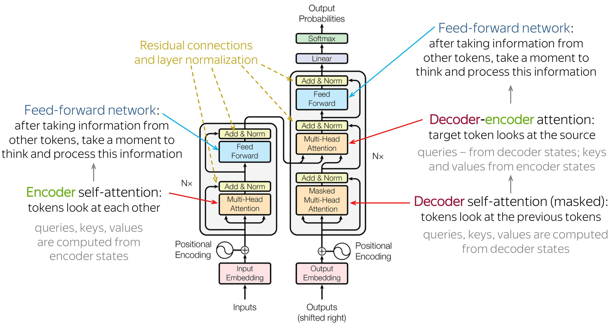

<p align="center">
    
</p>

# NanoGPT — Character-Level Transformer Language Model

A minimal, from-scratch implementation of a **decoder-only Transformer** (GPT-style) language model in PyTorch. The model is trained at the **character level** on Shakespeare's works and can generate new Shakespeare-like text after training.

---

## Project Summary

This project implements a simplified version of the GPT architecture, often referred to as "nanoGPT". The core idea is:

1. **Tokenize** a raw text corpus at the character level (each unique character is a token).
2. **Train** a Transformer-based language model to predict the next character given a context window.
3. **Generate** new text autoregressively by sampling from the learned distribution one character at a time.

The dataset used is the complete works of Shakespeare (`data/input.txt`, ~40,000 lines). The model uses 6 Transformer blocks, 6 attention heads, 384-dimensional embeddings, and trains for 5,000 iterations.

---

## Architecture

```
Input Characters
       │
       ▼
┌──────────────────┐
│  Token Embedding  │  (vocab_size → 384)
│    + Positional   │  (block_size → 384)
│     Embedding     │
└──────────────────┘
       │
       ▼
┌──────────────────┐
│  Transformer      │  ×6 blocks
│  Block            │
│  ┌──────────────┐ │
│  │ LayerNorm    │ │
│  │ Multi-Head   │ │  6 heads, 64 dims each
│  │ Self-Attn    │ │
│  │ + Residual   │ │
│  ├──────────────┤ │
│  │ LayerNorm    │ │
│  │ Feed-Forward │ │  384 → 1536 → 384
│  │ + Residual   │ │
│  └──────────────┘ │
└──────────────────┘
       │
       ▼
┌──────────────────┐
│  Final LayerNorm  │
│  Linear Head      │  (384 → vocab_size)
└──────────────────┘
       │
       ▼
   Next Token Logits
```

---

## Project Structure

```
nanogpt/
├── readme.md                    # This file
├── train.py                     # Main training script (entry point)
├── data/
│   └── input.txt                # Shakespeare text corpus (~40k lines)
├── model/
│   └── bigram/
│       ├── __init__.py          # Package init
│       ├── bigram.py            # BigramLanguageModel — top-level Transformer model
│       ├── block.py             # Block — single Transformer block (attention + FFN)
│       ├── forward.py           # FeedForward — position-wise feed-forward network
│       └── head.py              # Head & MultiHeadAttention — self-attention layers
├── util/
│   ├── __init__.py              # Package init
│   └── util.py                  # Hyperparameters, get_batch(), estimate_loss()
└── notebook/
    └── tes.ipynb                # Jupyter notebook for experimentation
```

---

## File & Class Documentation

### `train.py` — Main Training Script

The entry point of the project. Orchestrates the full pipeline:

| Step | Description |
|------|-------------|
| 1 | Reads raw text from `data/input.txt` |
| 2 | Builds character-level vocabulary (`stoi` / `itos` mappings) |
| 3 | Encodes text into a 1-D tensor of integer token indices |
| 4 | Splits data 80/20 into training and validation sets |
| 5 | Creates a `BigramLanguageModel` instance and moves it to GPU/CPU |
| 6 | Trains for `MAX_ITERS` steps using AdamW; logs loss every `EVAL_INTERVAL` |
| 7 | Generates 1,000 new characters and prints the output |

---

### `model/bigram/bigram.py` — `BigramLanguageModel`

The top-level Transformer language model class.

| Component | Description |
|-----------|-------------|
| `token_emb_table` | `nn.Embedding(vocab_size, n_embd)` — maps each character to a dense vector |
| `position_emb_table` | `nn.Embedding(block_size, n_embd)` — learnable positional encoding |
| `blocks` | `nn.Sequential` of `N_LAYER` Transformer `Block` modules |
| `ln_f` | Final `LayerNorm` applied before the output projection |
| `lm_head` | `nn.Linear(n_embd, vocab_size)` — projects to vocabulary logits |

**Methods:**

- **`forward(idx, targets=None)`** — Computes token + positional embeddings, passes through all Transformer blocks, and produces logits. Returns cross-entropy loss if targets are provided.
- **`generate(idx, max_new_tokens)`** — Autoregressively generates `max_new_tokens` new characters by repeatedly sampling from the softmax distribution over next-token logits.

---

### `model/bigram/block.py` — `Block`

A single Transformer block with **pre-norm residual connections**.

| Sub-layer | Description |
|-----------|-------------|
| `ln1` → `sa` | LayerNorm → Multi-Head Self-Attention + residual skip |
| `ln2` → `ffwd` | LayerNorm → Feed-Forward Network + residual skip |

---

### `model/bigram/head.py` — `Head` & `MultiHeadAttention`

#### `Head`
A single causal (masked) self-attention head.

| Component | Description |
|-----------|-------------|
| `key` | Linear projection for keys (no bias) |
| `query` | Linear projection for queries (no bias) |
| `value` | Linear projection for values (no bias) |
| `tril` | Lower-triangular causal mask (registered buffer) |
| `dropout` | Dropout on attention weights |

The attention scores are computed as: $\text{Attention}(Q, K, V) = \text{softmax}\!\left(\frac{QK^T}{\sqrt{d_k}}\right)V$

#### `MultiHeadAttention`
Runs multiple `Head` instances in parallel, concatenates their outputs, and applies a linear projection + dropout.

---

### `model/bigram/forward.py` — `FeedForward`

Position-wise feed-forward network applied independently to each token position.

```
Linear(n_embd → 4*n_embd) → ReLU → Linear(4*n_embd → n_embd) → Dropout
```

The 4× inner expansion gives the network more capacity for per-token computation.

---

### `util/util.py` — Hyperparameters & Utilities

#### Hyperparameters

| Parameter | Value | Description |
|-----------|-------|-------------|
| `BATCH_SIZE` | 64 | Number of parallel sequences per training step |
| `BLOCK_SIZE` | 256 | Maximum context window (sequence length) |
| `MAX_ITERS` | 5,000 | Total training iterations |
| `EVAL_INTERVAL` | 500 | Steps between loss evaluations |
| `EVAL_ITERS` | 200 | Batches averaged for loss estimation |
| `N_EMBD` | 384 | Embedding dimension (384 / 6 heads = 64 per head) |
| `DROPOUT` | 0.2 | Dropout rate |
| `N_LAYER` | 6 | Number of Transformer blocks |
| `N_HEAD` | 6 | Number of attention heads |
| `LR` | 3e-4 | AdamW learning rate |
| `DEVICE` | auto | `'cuda'` if available, else `'cpu'` |

#### Functions

- **`get_batch(data, context_length, batch_size)`** — Samples a random mini-batch of input-target pairs from the encoded data. Returns `(x, y)` tensors on the configured device.
- **`estimate_loss(data_train, data_val, model, eval_iters)`** — Estimates the mean loss on train and validation splits by averaging over `eval_iters` random batches with gradients disabled.

---

### `notebook/tes.ipynb` — Experimentation Notebook

A Jupyter notebook used for prototyping and testing individual components of the model. Contains 27 cells covering data loading, encoding/decoding, tensor operations, and model exploration.

---

## How to Run

```bash
# 1. Install PyTorch (see https://pytorch.org for your platform)
pip install torch

# 2. Train the model and generate text
python train.py
```

During training you will see output like:
```
step 0:    train loss 4.2741, val loss 4.2803
step 500:  train loss 1.9642, val loss 2.0351
step 1000: train loss 1.6120, val loss 1.7984
...
```

After training completes, the model generates 1,000 characters of Shakespeare-like text.

---

## Key Concepts

- **Character-level tokenization** — every unique character in the corpus is a token; no sub-word or word-level tokenization is used.
- **Causal (masked) self-attention** — each position can only attend to itself and earlier positions, enforcing the autoregressive property.
- **Pre-norm architecture** — LayerNorm is applied *before* each sub-layer (attention / FFN), which tends to be more stable during training.
- **Residual connections** — each sub-layer's output is added to its input, enabling gradient flow through deep networks.
- **Multinomial sampling** — during generation, the next token is *sampled* from the softmax distribution rather than greedily taking the argmax, producing more diverse and creative text.